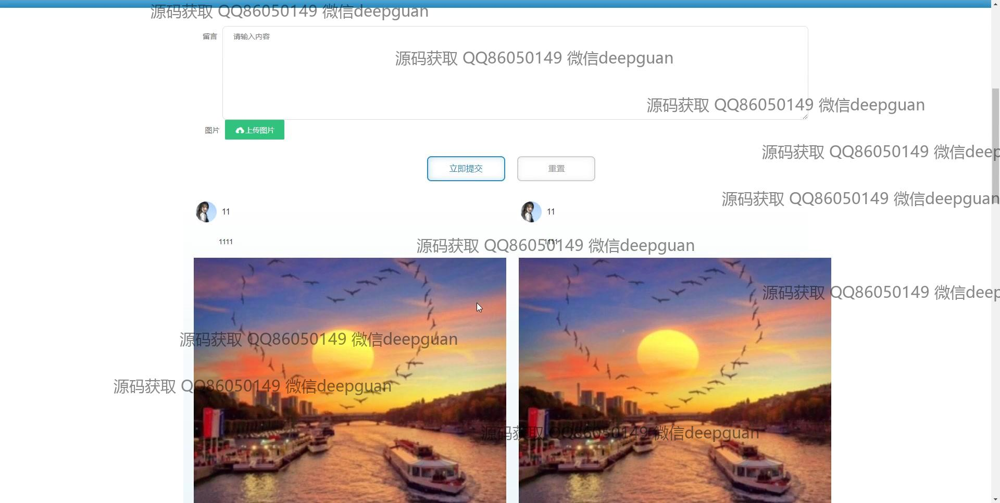

<h1 align="center">大学生互动交流网站设计与实现</h1>

## 简介
大学生互动交流网站：角色分为管理员、用户；包含用户管理、经验分享、交流论坛、通知公告、留言反馈功能模块，提供资源分享与互动交流平台，提高用户体验。    --计算机毕业设计源码；毕设源码；java毕业设计源码

## 联系方式

<h3 align="center">获取完整代码与数据库文件 + 微信：deepguan QQ: 86050149 QQ群: 783742310</h3>

<h3 align="center">可帮忙远程部署 包运行成功！提供远程部署、修改代码、设计文档指导、代码讲解等服务！</h3>

## 功能介绍（完整见运行截图）
管理员：主要功能包括管理用户信息、标签分类、经验分享、留言反馈和系统设置。管理员可以通过后台导航栏进入首页、用户管理、经验分享管理、交流论坛等模块，对网站内容进行全面管理，并可编辑通知公告及标签分类，支持文件上传和系统消息发布。

用户：基本功能包括注册、登录、退出，登录后可使用个人中心查看和修改个人信息。用户可以发布动态、分享经验、管理标签分类，上传文件和图片，与其他用户进行互动交流。用户还可通过交流论坛参与话题讨论，查看最新动态和热门话题。

访客：无需登录即可浏览网站首页，查看分享的资源内容和通知公告模块，了解平台功能和最新消息。访问过程中可预览用户分享的内容及图片，浏览论坛帖子以及平台的主要功能模块展示。

平台：支持通知公告、经验分享和留言反馈功能，包含内容发布和管理模块，提供导航栏快速访问首页、个人中心、交流论坛等板块。整体设计简洁直观，旨在为用户提供一个便捷高效的互动交流环境。

## 运行截图

本代码来源于网络,仅供学习参考使用!

